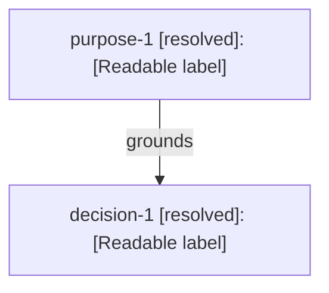

# Output Template

Use this template for the final or user-requested artifact. Replace every bracketed instruction with project-specific content. Keep every section in the order shown. If a section has no entries, write `None.` beneath its heading instead of omitting it. Do not leave placeholder rows or bracketed instructions in the finished artifact.

````markdown
# [Decision topic]

## Status

| Field | Value |
| --- | --- |
| Resolution | [Resolved, partially resolved, or unresolved] |
| Depth | [Shallow, standard, or deep] |
| Scope | [What this decision graph covers] |
| Decision frontier | [What is intentionally outside the current resolution boundary and why] |

## Purpose

- **Root purpose:** `purpose-1` — [The outcome that grounds downstream choices]
- **Beneficiary:** [Who benefits]
- **Desired change:** [What should become different]
- **Success criteria:** [Observable conditions for success]
- **Constraints:** [Material limits with `constraint-*` IDs, or `None.`]
- **Non-goals:** [Explicit exclusions, or `None.`]

## Decision Graph



[Replace the example with the concise graph. If Mermaid is unavailable, use an indented relationship map with the same node IDs and labeled relationships.]

## Decision Register

| ID | Status | Decision | Grounded by | Alternatives and tradeoffs | Implications |
| --- | --- | --- | --- | --- | --- |
| `decision-1` | [resolved or provisional] | [Chosen direction] | [Node IDs and concise rationale] | [Consequential alternatives and why they were not chosen] | [Choices, constraints, or work this decision causes] |

## Evidence

| ID | Status | Evidence | Source | Relevance |
| --- | --- | --- | --- | --- |
| `fact-1` | [resolved or provisional] | [Known or researched fact] | [Source or origin] | [What it grounds or changes] |

## Assumptions

| ID | Status | Assumption | Why it matters | Validation |
| --- | --- | --- | --- | --- |
| `assumption-1` | [provisional, open, or deferred] | [Unverified belief] | [Decision or outcome affected] | [Evidence, test, rule, or trigger that would resolve it] |

## Risks

| ID | Status | Risk | Consequence | Response or validation |
| --- | --- | --- | --- | --- |
| `risk-1` | [resolved, provisional, open, or deferred] | [What could invalidate or damage the path] | [Likely effect] | [Mitigation, test, decision rule, or acceptance rationale] |

## Open and Deferred Nodes

| ID | Status | Question or choice | Why it can remain open | Resolution trigger |
| --- | --- | --- | --- | --- |
| `question-1` | [open or deferred] | [Unresolved issue] | [Why work can proceed, or why this blocks resolution] | [Event, evidence, or decision that reopens or resolves it] |

## Handoff

### Settled

- [What later work may treat as decided or established]

### Still Open

- [What later work must preserve as provisional, open, or deferred]

### Next Meaningful Action

[The next action enabled by this graph, or `None.` if the user requested clarification only.]
````

## Template Rules

- Use the exact node IDs from the graph in every table and cross-reference.
- Use only `resolved`, `provisional`, `open`, or `deferred` for node status. The artifact-level resolution may be `Resolved`, `Partially resolved`, or `Unresolved`.
- Keep the same sections at every depth. Change the amount of detail, not the structure.
- Put one atomic item in each table row. Add rows as needed.
- Keep facts in **Evidence** and unverified beliefs in **Assumptions**.
- State material alternatives even when the user accepted the recommendation quickly.
- For an interrupted path, keep the same template, mark the artifact `Unresolved` or `Partially resolved`, and make blockers explicit in **Open and Deferred Nodes**.
- If the visual omits detail for readability, preserve it in the decision register or the relevant supporting table.
