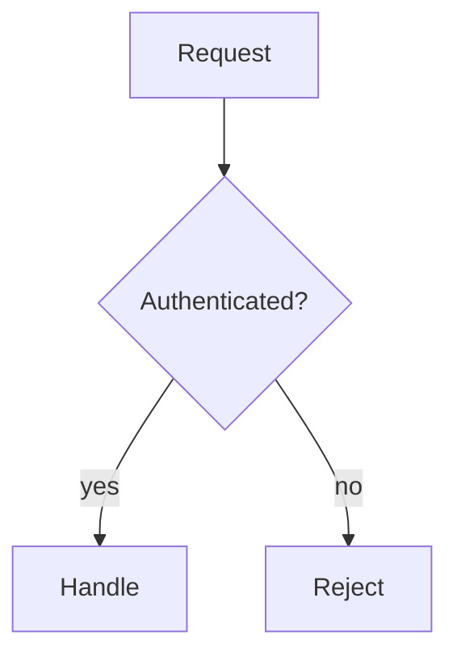
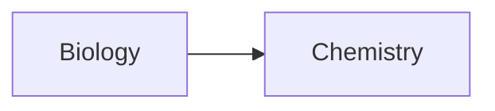

# Obsidian Formatting

Use the full Obsidian markdown dialect — not just plain text — when writing note content. Obsidian renders far more than CommonMark, and the extra elements make notes scannable, navigable, and reusable.

This skill is the authoring counterpart to:

- `obsidian-cli`: shared CLI syntax and safety rules
- `obsidian-notes`: lifecycle commands (create, append, properties)
- `obsidian-daily`: today's daily note
- `obsidian-tasks-tags`: task and tag commands
- `obsidian-search`: read-only exploration

## Rules

- Default to richer treatments (callouts, embeds, tables, block refs) over flat prose when they aid comprehension.
- Pick one element per purpose. Don't stack a callout, a blockquote, and a heading for the same idea.
- Match the casing, list style, and heading depth already in the target note. Conformance over taste.
- Don't invent plugin-specific syntax (Dataview, Admonition, Tasks plugin). Only what vanilla Obsidian renders.
- Inside `obsidian` CLI `content=` strings, only `\n` and `\t` are interpreted. Multi-line rich content should go through the temp-file pattern in `obsidian-cli`.

## When To Reach For What

| Goal | Use |
| --- | --- |
| Highlight an aside, warning, tip, FAQ | Callout (`> [!tip]`) |
| Hide long supporting detail behind a toggle | Foldable callout (`> [!info]-`) |
| Reuse a paragraph or list from another note | Block ref + transclusion (`![[Note#^id]]`) |
| Pull in a section by heading | Heading transclusion (`![[Note#Heading]]`) |
| Show an image at a specific size | Sized image embed (`![[img.png\|400]]`) |
| Use a vector asset for a diagram or icon | SVG embed (`![[diagram.svg]]`) |
| Compare options on multiple axes | Table (with column alignment) |
| Show flow, sequence, or state | Mermaid code fence |
| Show a formula | Inline `$...$` or block `$$...$$` |
| Cite a source mid-sentence without breaking flow | Footnote (`[^1]`) |
| Mark draft text or notes-to-self the reader shouldn't see | Comment (`%%...%%`) |
| Mark a non-binary task state (in-progress, blocked, cancelled) | Custom task status (`- [/]`, `- [-]`, `- [>]`) |
| Annotate something specific in a passage | Highlight (`==text==`) |

## Callouts

Best tool for visually breaking out asides without hijacking the heading hierarchy. Foldable variants are great for long supporting content.

```md
> [!tip] Custom title here
> Body content. Supports **markdown**, [[wikilinks]], and ![[embeds]].
> Continue with another `>` line.
```

Foldable: append `+` (expanded by default) or `-` (collapsed by default) after the type:

```md
> [!info]- Click to expand the details
> Hidden by default until the reader opens it.
```

Nest by adding `> >`:

```md
> [!question] Outer
> > [!example] Nested example
> > Detail here.
```

Built-in types (aliases in parens):

| Type | Aliases | Use for |
| --- | --- | --- |
| `note` | — | Generic side note |
| `abstract` | `summary`, `tldr` | Summary at the top of a long note |
| `info` | — | Informational context |
| `todo` | — | Action items inline in prose |
| `tip` | `hint`, `important` | Recommendations |
| `success` | `check`, `done` | Positive outcomes, confirmations |
| `question` | `help`, `faq` | FAQs, open questions |
| `warning` | `caution`, `attention` | Risks, gotchas |
| `failure` | `fail`, `missing` | Negative outcomes, gaps |
| `danger` | `error` | Critical risks, breaking issues |
| `bug` | — | Bug reports |
| `example` | — | Worked examples |
| `quote` | `cite` | Quotations with attribution |

## Embeds (Transclusion)

Use `![[...]]` to render the target inline rather than linking to it. This is one of Obsidian's most underused features and the main reason notes don't have to repeat themselves.

```md
![[Other Note]]                  # entire note
![[Other Note#Heading]]          # just that section
![[Other Note#^block-id]]        # just that block
```

### Where To Save New Attachments

When adding a new attachment file (image, SVG, PDF, audio, video) to the vault, save it to the vault's configured attachment folder rather than next to the note or at the vault root. Only applies when creating a new file — existing attachments stay where they are.

Discover the configuration before writing:

```bash
obsidian vault info=path
obsidian eval code='app.vault.getConfig("attachmentFolderPath")'
```

Interpret the returned value as follows:

| Returned value | Mode | Save the file to |
| --- | --- | --- |
| `""` or `"/"` | Vault folder | `<vault-path>/` |
| `"./"` | Same folder as current file | the directory of the note that will reference it |
| Starts with `./` (e.g. `"./_files"`) | Subfolder of current folder | `<note-dir>/<suffix>/` |
| Anything else (e.g. `"_attachments"`) | Specified folder | `<vault-path>/<value>/` |

If `attachmentFolderPath` is missing from `app.json`, treat it as vault root. Create the destination folder if it does not yet exist. After saving, reference the file by name with `![[filename.ext]]` — wikilink resolution by name does not depend on where the file lives, so a short reference keeps working if attachments later move.

### Images

```md
![[image.png]]
![[image.png|400]]               # width 400, height auto
![[diagram.png|400x250]]         # width x height
![[logo.svg|120]]                # SVGs work the same way
```

Supported image formats (vanilla): `.avif`, `.bmp`, `.gif`, `.jpeg`, `.jpg`, `.png`, `.svg`, `.webp`.

SVG specifics: SVGs render as crisp vector at any size, can include text and links, and can be authored to act as scalable diagrams or decorative banners. Prefer SVG over PNG for charts, icons, system diagrams, and anything that needs to scale.

External images use markdown image syntax with the same sizing pipe:

```md

```

If a wikilink alias contains a `|`, escape it: `[[Note\|Display]]`.

### PDFs

```md
![[Doc.pdf]]
![[Doc.pdf#page=3]]
![[Doc.pdf#height=400]]
![[Doc.pdf#page=3&height=400]]
```

### Audio, Video, Canvas

```md
![[clip.mp3]]
![[demo.mp4]]
![[Architecture.canvas]]
```

Audio: `.flac`, `.m4a`, `.mp3`, `.ogg`, `.wav`, `.webm`, `.3gp`.
Video: `.mkv`, `.mov`, `.mp4`, `.ogv`, `.webm`.

## Wikilinks And Block References

```md
[[Note]]                         # basic
[[Note|Display Text]]            # custom label
[[Note#Heading]]                 # link to heading
[[Note#H1#H2]]                   # link to subheading
[[#Heading In This Note]]        # same-note heading link
[[Note#^block-id]]               # link to block
```

Create a block ID by suffixing a paragraph or list item with `^id` (Latin letters, numbers, dashes only):

```md
This is the paragraph I want to reuse later. ^key-insight

- A list item that should be quotable. ^my-item
```

For structured blocks (lists, quotes, tables) the ID goes on its own line with blank lines around it:

```md
> A multi-line quote
> we want to reference.

^pivotal-quote
```

Use human-readable IDs (`^why-this-matters`) over auto-generated hex IDs whenever the block is meant to be reused intentionally — the link reads better and survives edits.

## Tables

Use tables for comparison, decision matrices, status grids, and option/tradeoff summaries. Avoid them for narrative content.

```md
| Option | Cost | Risk | Recommended |
| ------ | ---: | :--: | :---------- |
| A      |  $10 |  Low | Yes         |
| B      | $100 | High | No          |
```

Alignment row:

- `:---` left
- `:---:` center
- `---:` right

Inside a table cell, escape vertical bars in wikilink aliases as `\|`.

## Code

Inline: `` `code` ``. Code blocks use a fenced block with a language hint — always include the language so syntax highlighting and copy buttons work:

````md
```python
def fib(n):
    return n if n < 2 else fib(n-1) + fib(n-2)
```
````

To embed a fenced block inside another fenced block, the outer fence uses more backticks (`````` for outer, ``` for inner).

## Math

Vanilla Obsidian renders MathJax / LaTeX:

```md
Inline: $e^{i\pi} + 1 = 0$.

Block:
$$
\begin{vmatrix}
a & b \\
c & d
\end{vmatrix}
= ad - bc
$$
```

## Mermaid Diagrams

Use a fenced block with `mermaid` as the language. Vanilla Obsidian supports flowcharts, sequence, class, state, ER, gantt, pie, and journey diagrams.

````md

````

To make Mermaid nodes link to vault notes, attach the `internal-link` class:

````md

````

Then `Biology` and `Chemistry` clicks open the matching notes.

## Footnotes

Use named footnotes for sources or tangents that would interrupt prose:

```md
This is the claim.[^source]

[^source]: Smith, 2024. Full citation here.
```

Inline footnotes (rendered in Reading view only):

```md
The point is clear ^[and here is the supporting aside].
```

## Highlights, Strikethrough, Comments

```md
==highlighted==                  # call attention
~~struck through~~               # superseded text
%%hidden author note%%           # invisible in Reading view; useful for drafts and TODOs
```

Comments are great for marking "fill this in later" without polluting the rendered note. Strikethrough is preferred over deleting when the history matters.

## Task Lists With Status Characters

Vanilla Obsidian renders any single character inside `[ ]` as a custom status. Common conventions:

```md
- [ ] todo
- [x] done
- [/] in progress
- [-] cancelled
- [>] forwarded / scheduled
- [?] needs decision
- [!] blocked or important
```

For listing and updating tasks via the CLI, see `obsidian-tasks-tags`.

## Frontmatter Properties (Quick Reference)

For full property mechanics and CLI commands, see `obsidian-notes`. Render-relevant rules:

- Tags as a YAML list: `tags:\n  - project\n  - active`
- Aliases as a YAML list: `aliases:\n  - "Other Name"`
- Internal links inside string properties must be quoted: `link: "[[Episode IV]]"`
- Reserved: `tags`, `aliases`, `cssclasses`, `publish`, `permalink`, `description`, `image` / `cover`

## Headings, Lists, Horizontal Rules

- Headings: `#` through `######`. Don't skip levels. Reserve `# H1` for the note's own title only if the vault convention does so; many vaults rely on the filename as the title and start at `## H2`.
- Unordered lists: prefer `-` for consistency with most Obsidian styles.
- Ordered lists: `1.` form.
- Horizontal rule: `---` on its own line. Use sparingly; usually a heading is a clearer break.

## Anti-Patterns

- Wall of paragraphs when the content is a comparison, sequence, or set of options. Reach for a table, list, or callout.
- A bare `![[image.png]]` when the image is huge and dominates the note. Size it (`|400`) or move it under a foldable callout.
- Re-pasting content that already lives in another note. Use a block or heading transclusion (`![[Note#^id]]`) so it stays in sync.
- Bolding entire paragraphs as a substitute for a callout.
- Skipping language hints on code fences.
- Inventing block IDs like `^abc123` when a human-readable one (`^pricing-decision`) communicates intent.
- Using a horizontal rule between every section instead of headings.
- Stacking three callouts when one section heading would do.
