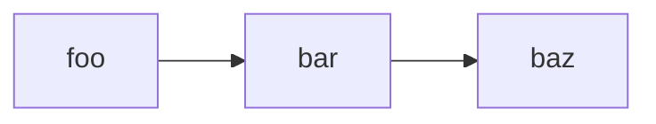

# Plan File Contract

The single source of truth for the `plan-*` skills (`plan-create`, `plan-phase`,
`plan-reflect`, `plan-auto`, `plan-multi`). Every one of those skills reads and
writes the same artifact; this file defines that artifact exactly so two runs
never disagree about format, status, or location.

If anything in a skill seems to conflict with this file, **this file wins** —
fix the skill.

---

## 1. Where plans live

### Standalone plan (created by `plan-create` on its own)

- Path: `plans/<YYYY-MM-DD>-<slug>.md` where the date is today and `<slug>` is a
  kebab-case slug derived from the goal (e.g. `plans/2026-05-29-auth-refactor.md`).
- Use an existing repo `plans/` directory if one exists; otherwise create `plans/`
  at the repo root.
- If a file with that exact name already exists, append `-2`, `-3`, … — never
  overwrite.
- No frontmatter.

### Multi-plan artifact (created by `plan-multi`)

- Parent directory: `plans/<YYYY-MM-DD>-<parent-slug>/`
- Parent index: `<parent-dir>/index.md`
- Each child plan: `<parent-dir>/<NN>-<child-slug>.md`, where `<NN>` is the
  1-based position in topological order, **zero-padded to two digits** (`01`,
  `02`, …). The `<NN>-<child-slug>` token is identical in the filename, the index
  link, and the dependency graph.
- Every child plan carries the frontmatter block in §2.

### Storage backend (which tools to read/write with)

Decided by the file path, not by the skill:

- If the plan file (or parent index) path is **inside the Obsidian vault**, use
  the `obsidian` CLI for every read and write of that file.
- Otherwise use ordinary file tools.

`plan-multi` always writes to the vault, so its children and index are always
edited via the `obsidian` CLI. A standalone `plan-create` plan is a repo file
edited with ordinary tools unless the repo itself lives inside the vault.

---

## 2. Plan document schema

A child plan's frontmatter is present **only** for `plan-multi` children, and is
written **with its `---` fences**, prepended verbatim above the `#` heading:

```
---
parent_plan: ./index.md
plan_index: N
total_plans: M
depends_on: [slug-a, slug-b]
---
```

Standalone plans omit the frontmatter entirely.

Body structure (identical for standalone and child plans):

```md
# [Project or Feature Name]

## Goal
- [What is being built or changed]

## Constraints
- [Technical, product, compliance, migration, timeline, or compatibility constraints]

## Assumptions
- [Only assumptions you are actively relying on]

## Phase 1: [Name]
- Status: pending
- Objective: [What this phase accomplishes]

### Deliverables:
- [Concrete, checkable output]

### Dependencies:
- [Phase <N> | sibling <slug> | "none"]

### Validation:
- [A runnable check or observable result — see §3]

### Notes:
- [Optional: only if needed for safe execution]

### Delegation Notes:
- [Optional: what is safe to parallelize, what stays local, ownership boundaries]

## Phase 2: [Name]
- Status: pending
- Objective: ...

## Open Questions
- [Only unresolved items that still matter. Omit the section if there are none.]
```

### Phase heading format (a hard contract)

`## Phase <N>: <Name>` — `<N>` starts at 1, increments by 1, **contiguous, no
gaps, no sub-numbers** (`Phase 2a` is illegal). Downstream skills identify,
order, and cross-reference phases by this integer. Do not rename or renumber a
phase once it exists; record provenance in a note bullet instead of editing the
heading.

### Validation criteria must be falsifiable

Each phase's `Validation:` must be a concrete check a verifier can re-run or
observe without re-deriving intent — e.g. `pytest tests/auth -k login passes`,
`GET /health returns 200`, `the migration applies cleanly on a fresh DB`. Avoid
unfalsifiable phrasing like "works correctly" or "looks right." `plan-reflect`
re-runs these criteria; if they are vague it cannot verify the phase.

---

## 3. Phase status — the core contract

Every phase has **exactly one** status line:

```
- Status: <value>
```

There is no checkbox. The only legal values are, lowercase and hyphenated:

| Value | Meaning |
|---|---|
| `pending` | Not started. |
| `in-progress` | Started but not yet verified complete. May carry a `- Remaining:` bullet listing what is left (this is how *partial* work is recorded). |
| `complete` | `plan-reflect` verified it: objective met, every deliverable present in the repo, and every `Validation:` criterion re-run and passed. |
| `blocked` | Cannot proceed without a user decision or external prerequisite. Carries a `- Blocked on:` bullet naming what is needed. |

**Only `complete` counts as done.** For every resume/stop decision, treat
`pending`, `in-progress`, and `blocked` all as "not done."

### Who sets which transition (single, non-overlapping ownership)

| Transition | Owner | When |
|---|---|---|
| `pending → in-progress` | `plan-phase` | The moment it begins the phase. This start-marker write is the **only** edit `plan-phase` makes to the plan body. |
| `in-progress → complete` | `plan-reflect` | Only when verification earns it. |
| `in-progress → blocked` | `plan-reflect` | When the phase cannot finish without outside input. Adds a `- Blocked on:` bullet. |
| add/update `- Remaining:` | `plan-reflect` | When a phase is partially done; it stays `in-progress`. |

`plan-reflect` never sets a phase back to `pending`. No skill writes any status
value not in the table above.

### Partial and blocked notes

When `plan-reflect` leaves a phase `in-progress` (partial) or `blocked`, it
writes the outstanding work **into the plan file** so the next run is resumable
from the file alone. When that phase later becomes `complete`, `plan-reflect`
**removes** these notes — a `complete` phase must carry no `Remaining:`/`Blocked
on:` bullets.

```md
## Phase 3: API Integration
- Status: in-progress
- Remaining:
  - Retry/backoff on the upstream call is not yet implemented.
- Objective: ...
```

```md
## Phase 4: Rollout
- Status: blocked
- Blocked on:
  - Need product decision on the default feature-flag state.
- Objective: ...
```

---

## 4. Multi-plan parent index

The index lists every child with its status. Format (outer fence shown with
tildes only so the inner Mermaid fence is readable):

~~~md
# [Project Name]

## Overview
[2-3 sentences describing the whole effort across children]

## Global Constraints
- [Constraints that apply to every child plan]

## Assumptions
- [Cross-cutting assumptions]

## Plan Dependency Graph


## Plans
1. [Plan 1 Name](01-foo.md) — pending
2. [Plan 2 Name](02-bar.md) — pending

## Open Questions
- [Only unresolved items that still matter across plans]
~~~

### Index status values

Same four values as a phase, same spelling: `pending`, `in-progress`,
`complete`, `blocked`.

| Index value | Set by | When |
|---|---|---|
| `pending` | `plan-multi` | When the child file is first written. |
| `in-progress` | `plan-phase` | When it starts a phase of a child whose index line still reads `pending`. |
| `complete` | `plan-reflect` | When **every** phase of that child is `complete`. |
| `blocked` | `plan-reflect` | When a phase of that child is `blocked`. |

### Locating and updating a child's index line (robust matching)

Do not match on the delimiter glyph. Match like this:

1. Find the list item in `## Plans` whose markdown link **target** equals the
   child's filename `<NN>-<child-slug>.md`.
2. The status is the **final whitespace-separated token** on that line, and is
   one of the four values.
3. To update, replace that final token. Leave the rest of the line untouched.

The visible ` — ` separator is for humans; matching depends only on the link
target and the trailing status word, so a stray hyphen/en-dash never breaks sync.

### Identifiers

- A child's canonical id is its bare `<slug>` (no `NN-` prefix). `depends_on`
  lists bare slugs; Mermaid graph nodes use bare slugs.
- The `NN-<slug>.md` form appears only in filenames and index link targets.

---

## 5. Invariants (quick reference)

- One `- Status:` line per phase; value ∈ {`pending`, `in-progress`, `complete`,
  `blocked`}; no checkbox.
- Only `complete` means done.
- `plan-phase` writes `pending → in-progress` and nothing else in the plan body.
- `plan-reflect` is the only writer of `complete`/`blocked` and of `Remaining:`/
  `Blocked on:` notes; it verifies against the repo before writing.
- Phases are `## Phase <N>:`, numbered from 1, contiguous.
- Standalone plan path: `plans/<YYYY-MM-DD>-<slug>.md`. Multi: see §1.
- Vault path ⇒ `obsidian` CLI; otherwise ordinary file tools.
- Child frontmatter is written **with** `---` fences.
- Index lines are matched by link target + trailing status word.
