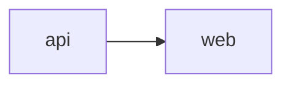

# Plan Directory Contract

The `plan-*` skills use a directory-backed plan artifact. This file is the
single source of truth for its layout, schemas, and status ownership. If a
skill disagrees with this contract, fix the skill.

Each phase lives in its own file. Skills load the compact plan index and only
the phase files needed for their work.

---

## 1. Where plans live

Resolve the plan root from user context. If it is not explicit, use an existing
workspace-root `plans/` directory or create `plans/` at the workspace root.

### Standalone plan

- Directory: `<resolved-dir>/<YYYY-MM-DD>-<slug>/`.
- Index: `<plan-dir>/index.md`.
- Phase files: `<plan-dir>/phase-<NN>-<phase-slug>.md`, where `<NN>` is a
  two-digit, 1-based position (`01`, `02`, …).
- If the directory already exists, append `-2`, `-3`, … to the directory name.
  Never overwrite an existing plan.

### Multi-plan artifact

- Parent directory: `<resolved-dir>/<YYYY-MM-DD>-<parent-slug>/`.
- Parent index: `<parent-dir>/index.md`.
- Child directory: `<parent-dir>/plan-<NN>-<child-slug>/`, numbered in
  topological order with a two-digit `<NN>`.
- Each child directory is a standalone plan directory: it has its own
  `index.md` and `phase-<NN>-<phase-slug>.md` files.
- A child's canonical identifier is its bare `<child-slug>`. Derive it from the
  child directory name; use it in dependency declarations and graph nodes.

Directory names never end in `.md`. Markdown suffixes are reserved for files.

### Locating an executable plan

`plan-phase`, `plan-reflect`, and `plan-auto` accept a plan directory, that
directory's `index.md`, or a phase-file path. Resolve a phase-file path to its
containing plan directory. A multi-plan parent index is not executable; ask the
user to identify a child plan.

---

## 2. Index schemas

Indexes are bounded manifests. They never contain a phase or child-plan status.
Their links establish order and are the recovery manifest after an interrupted
creation run.

### Plan index

Every standalone or child plan directory has this format:

````md
# [Project or Feature Name]

## Goal

- [What is being built or changed]

## Constraints

- [Technical, product, compliance, migration, timeline, or compatibility constraints]

## Assumptions

- [Only assumptions actively relied on]

## Phases

1. [Phase 1: Discovery](phase-01-discovery.md)
2. [Phase 2: Implementation](phase-02-implementation.md)

## Open Questions

- [Only unresolved items that still matter across phases. Omit this section if empty.]
````

The `## Phases` list is ordered. Its markdown link targets must exactly match
the filenames in the plan directory. No status token or other live-progress
summary may appear on its entries.

### Multi-plan parent index

````md
# [Project Name]

## Goal

- [The global outcome this multi-plan artifact delivers]

## Overview

[2–3 sentences describing the whole effort across children]

## Global Constraints

- [Constraints that apply to every child plan]

## Assumptions

- [Cross-cutting assumptions]

## Plan Dependency Graph



## Plans

1. [API migration](plan-01-api/) — owns API contracts and server migration.
   - Goal: Move the API safely to the new platform contract.
   - Constraints:
     - Preserve existing API compatibility.
   - Depends on: none
2. [Web migration](plan-02-web/) — owns client integration and browser tests.
   - Goal: Move the web client to the new platform contract.
   - Constraints:
     - Maintain the existing browser support policy.
   - Depends on: [api]

## Open Questions

- [Only unresolved items that still matter across plans. Omit this section if empty.]
````

The parent index owns the child scope map, ordering, dependency graph, and
recovery brief. Each `## Plans` entry names its child directory and exclusive
scope, then includes a goal, relevant child-specific constraints, and a
bare-slug `Depends on:` list. The Mermaid graph must be derived from those
lists. This metadata must be sufficient to regenerate a missing child directory
without relying on chat history. It does not hold child status. A child plan's
progress is derived from the status lines in its phase files when someone
requests it.

An edge `a --> b` means child `b` declares `Depends on: [a]`.

### Structural validation

Before executing or reflecting, fail loudly if an index is malformed: a required
section is missing, a phase or child link is missing or duplicated, a phase link
does not resolve, ordering is non-contiguous, a phase filename and heading
number disagree, or a phase has no legal status line. Never guess an intended
phase or silently repair a damaged artifact while executing it. `plan-create`
may repair only the artifact it is currently creating.

For a multi-plan parent index, also fail if a child entry lacks its goal,
constraints, or `Depends on:` list; a dependency names an unknown child; the
Mermaid graph disagrees with those lists; or a child dependency is not represented
by at least one phase-level `sibling <slug>` dependency in that child directory.

---

## 3. Phase-file schema

Each file linked from `## Phases` has exactly one phase and this format:

```md
# Phase <N>: [Name]

- Status: pending
- Objective: [What this phase accomplishes]

## Deliverables

- [Concrete, checkable output]

## Dependencies

- [Phase <N> | sibling <slug> | "none"]

## Validation

- [A runnable check or observable result — not "works correctly"]

## Notes

- [Optional: only what is needed for safe execution]

## Delegation Notes

- [Optional: safe parallel work, local work, and ownership boundaries]
```

The `# Phase <N>: <Name>` heading and the filename number must agree. A phase
has exactly one `- Status: <value>` line. The only legal values are `pending`,
`in-progress`, `complete`, and `blocked`; only `complete` counts as done.

For a partial or blocked phase, `plan-reflect` adds one of these directly below
the status line:

```md
- Remaining:
  - [Specific unfinished work or validation]
```

```md
- Blocked on:
  - [Required user decision or external prerequisite]
```

A complete phase carries neither note.

### Cross-plan dependencies

`sibling <slug>` is valid only in a child plan. It must name a bare sibling slug
from the parent `## Plans` list, and that child's parent entry must list the slug
under `Depends on:`. Every slug in that parent list must be used by at least one
phase-level sibling dependency.

To verify a sibling dependency, resolve the child plan's parent index at
`../index.md`. Find the parent entries for the current child and named sibling
by their `plan-<NN>-<slug>/` link targets. Then read the sibling index and only
the status lines of its linked phase files. The dependency is satisfied only
when every sibling phase is `complete`; otherwise stop before changing the
current phase's start marker. No index receives a derived status.

---

## 4. Status ownership

| Transition or edit | Owner | Rule |
| --- | --- | --- |
| `pending → in-progress` | `plan-phase` | Set when execution begins. |
| `blocked → in-progress` | `plan-phase` | Only after it verifies the recorded blocker is resolved; remove `Blocked on:`. |
| `in-progress → complete` | `plan-reflect` | Only after every deliverable and validation is verified. |
| `in-progress → blocked` | `plan-reflect` | Add `Blocked on:` with the missing prerequisite. |
| `Remaining:` / `Blocked on:` | `plan-reflect` | Keep the phase resumable from its file alone. |

No index mirrors these values. `plan-phase` edits only the selected phase's
start marker, except that it may clear a resolved `Blocked on:` note while
resuming a blocked phase. `plan-reflect` edits the selected phase and only
downstream phase files that need a revision.

---

## 5. Revising phase order

Phase numbers and filenames are stable once a phase is `in-progress`,
`complete`, or `blocked`. Reflection may insert a new prerequisite only by
renumbering and renaming later **pending** phase files, then updating their
headings, index links, and phase-number dependencies together.

If work newly discovered as a prerequisite must precede a started, complete, or
blocked phase, do not rewrite history. Mark the current plan blocked and create
or request a follow-up plan.

---

## 6. Invariants

- Every plan index is compact and contains no live status.
- Every phase link resolves to one phase file, and every phase file is linked
  exactly once.
- Phase files are ordered by the `## Phases` list, not by an arbitrary directory
  scan.
- Every phase has one legal status line and falsifiable validation criteria.
- A parent multi-plan index links child directories only; it never synchronizes
  child execution status.
- Parent child briefs and phase-level sibling dependencies agree exactly.
